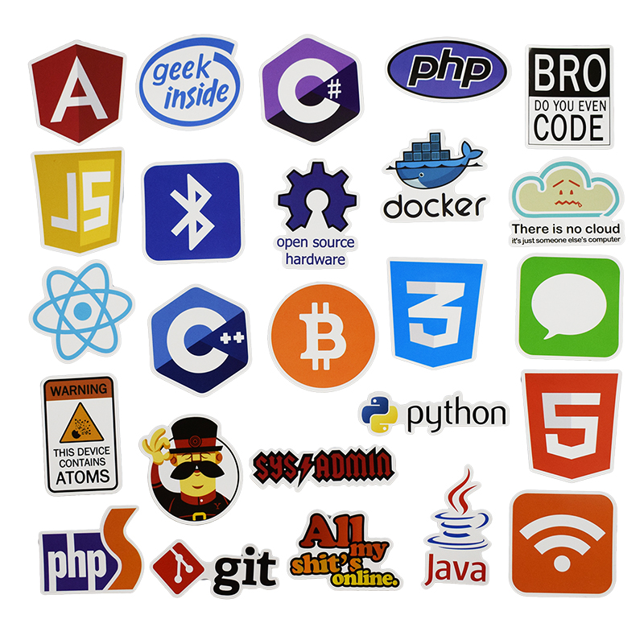

# about-me
## Links
* **Source Repository:** [https://github.com/yugimamidi/about-me](https://github.com/yugimamidi/about-me)
* **Hosted Page:** [https://yugimamidi.github.io/about-me/](https://yugimamidi.github.io/about-me/)

## About
This Page is used to describe about the tools and different languages that can be used in GitHub to create web pages

## Recommended Tools
GitHub is a great tool to store projects and to collaborate with others, but its usefulness does not stop there. We’ll use a service called GitHub Pages to share our web page creations on the World Wide Web.

There are many different ways to deploy a website to the public Internet. We’ll be using GitHub’s free service called GitHub Pages.

**Markdown** is the mostly used syntax to edit in github pages, where we can give first level heading,second level heading upto six levels using #, In the same way there are many other representations for lists,links and blockquotes.
refer [Basic Syntax Markdown](https://www.markdownguide.org/basic-syntax/) for syntax

The following are the recommended tools for GitHub,

* [Codefactor](https://github.com/marketplace/codefactor)
* [Imgbot](https://github.com/marketplace/imgbot)
* [Code-Climate](https://github.com/marketplace/code-climate)
* [Zube](https://github.com/marketplace/zube)

### Reference: [https://www.codecademy.com/articles/f1-u3-github-pages](https://www.codecademy.com/articles/f1-u3-github-pages)

### Languages
The languages used are Ruby,JavaScript,Java,Python,PHP,C,C++,C#,TypeScript,Shell
we're coding on GitHub in hundreds of programming languages, but JavaScript still has the most contributors in public and private repositories, organizations of all sizes, and every region of the world
TypeScript is now in the top 10 most used languages across all regions GitHub contributors come from—and across private, public, and open source repositories.

### Reference: [https://octoverse.github.com/projects.html](https://octoverse.github.com/projects.html)

## Recommended Resources
To create web application related projects kindly refer to the following links

- [https://github.com/MilanAryal/web-development-resources](https://github.com/MilanAryal/web-development-resources)
- [https://github.com/alphadsy/w3schools-templates-using-Bootstrap](https://github.com/alphadsy/w3schools-templates-using-Bootstrap)
- [https://github.com/reactjs/react-tutorial](https://github.com/reactjs/react-tutorial)

## Contributors
**Name**: Yugandhar Mamidi, 
**Course**: Applied Computer Science

##### Image Referemce: [https://ae01.alicdn.com/kf/HTB1XV_aaNuTBuNkHFNRq6A9qpXaJ/50-Pcs-Java-Internet-JS-Php-Docker-Bitcoin-Html-Cloud-Programming-Language-APP-Logo-Funny-Stickers.jpg](https://ae01.alicdn.com/kf/HTB1XV_aaNuTBuNkHFNRq6A9qpXaJ/50-Pcs-Java-Internet-JS-Php-Docker-Bitcoin-Html-Cloud-Programming-Language-APP-Logo-Funny-Stickers.jpg)

